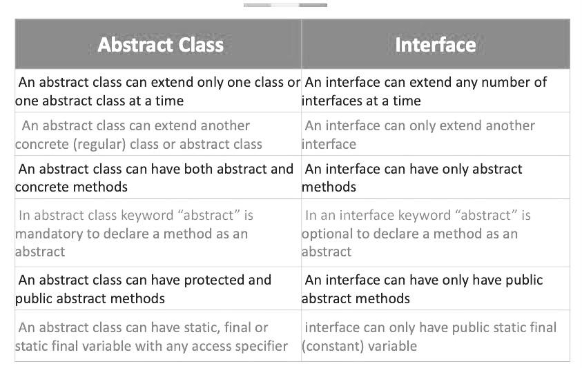

# If you're confused by these classes you are not alone! Hopefully these resources will help shine some light on what exactly they are and how they are used.

Here are the links to the coursework videos on [Interfaces](https://courses.coderscampus.com/students/courses/274/sections/678/lessons/4843), [Abstract_Classes](https://courses.coderscampus.com/students/courses/274/sections/678/lessons/4844), [Extending_an_abstract_class](https://courses.coderscampus.com/students/courses/274/sections/678/lessons/4845), and [Using_an_abstract_class](https://courses.coderscampus.com/students/courses/274/sections/678/lessons/4846).

