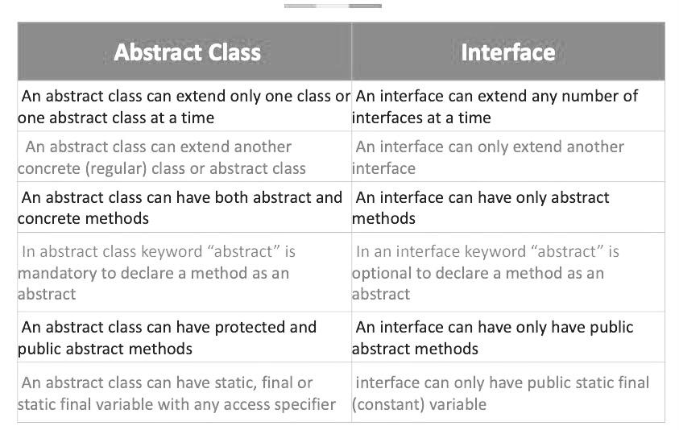

# If you're confused by these classes you are not alone! Hopefully these resources will help shine some light on what exactly they are and how they are used.

Here are the links to the coursework videos on [Interfaces](https://courses.coderscampus.com/students/courses/274/sections/678/lessons/4843), [Abstract_Classes](https://courses.coderscampus.com/students/courses/274/sections/678/lessons/4844), [Extending_an_abstract_class](https://courses.coderscampus.com/students/courses/274/sections/678/lessons/4845), and [Using_an_abstract_class](https://courses.coderscampus.com/students/courses/274/sections/678/lessons/4846).

# Simple table on the differences between the two:

- The [Baeldung](https://www.baeldung.com/java-interface-vs-abstract-class) page on Interface vs. Abstract has a great short explanation as well.  This is a great site for stellar explanations about anything Java that you could think of.

- [Here](https://www.youtube.com/watch?v=uA_6W4aWRFg) is a YouTube vid with a great explanation using video game characters on the differences between the two.

- And [here](https://www.youtube.com/watch?v=2aQ9Y7bumts) is yet another YouTube with nice, simple comparisons between the two.

- Coding with John (super awesome teacher on YouTube) has this [video](https://www.youtube.com/watch?v=HvPlEJ3LHgE) that breaks down abstract classes in a super simple, informative way.

- And [here](https://www.youtube.com/watch?v=kTpp5n_CppQ) is another video from Alex Lee, another great coding YouTuber, on Interfaces.

### As we say so often, you can ask chat gpt to explain things to you, for exmple:
### "Please explain what interfaces are in Java, and how and why I'd use them".

### And don't be afraid, if you are working on an exercise or assignment, to reach out to one of the full-stackers for help/explanations.  It's good review for them! 