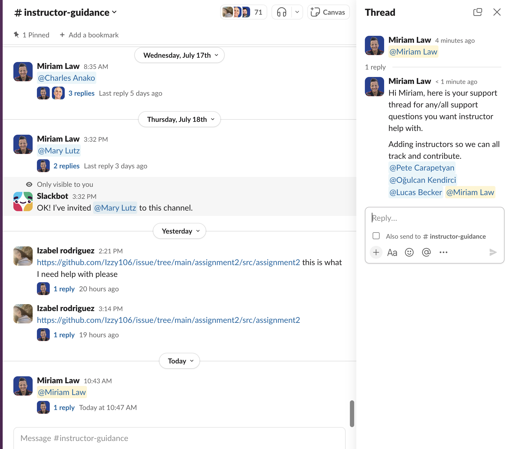
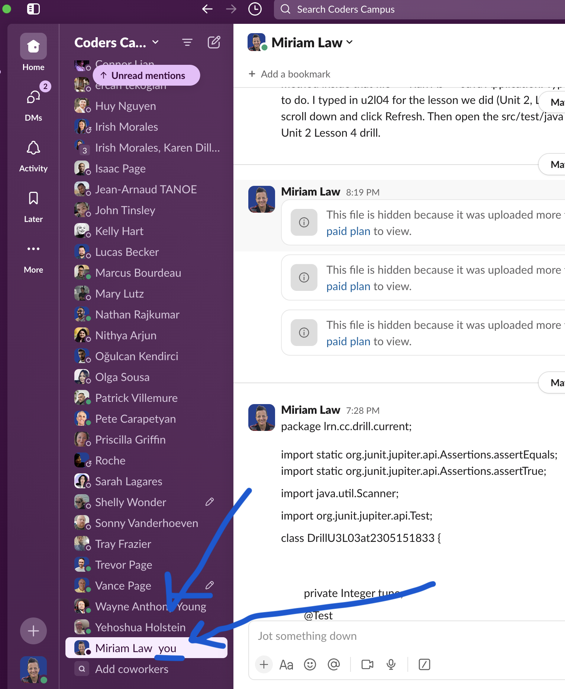
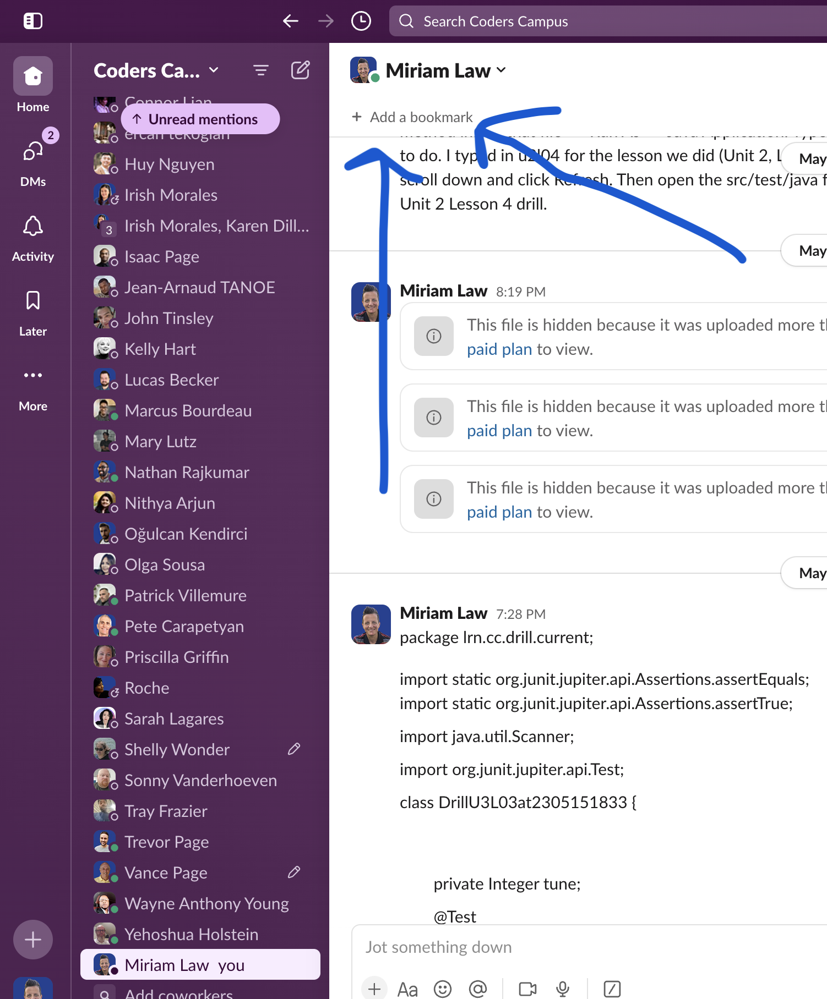
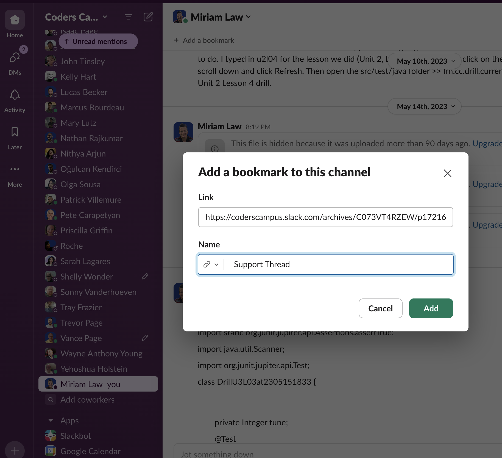
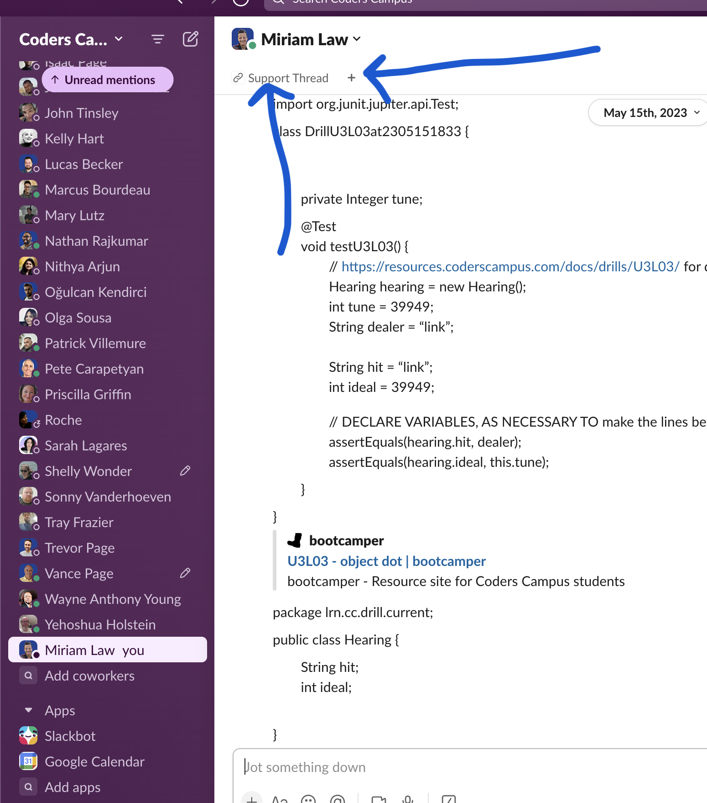
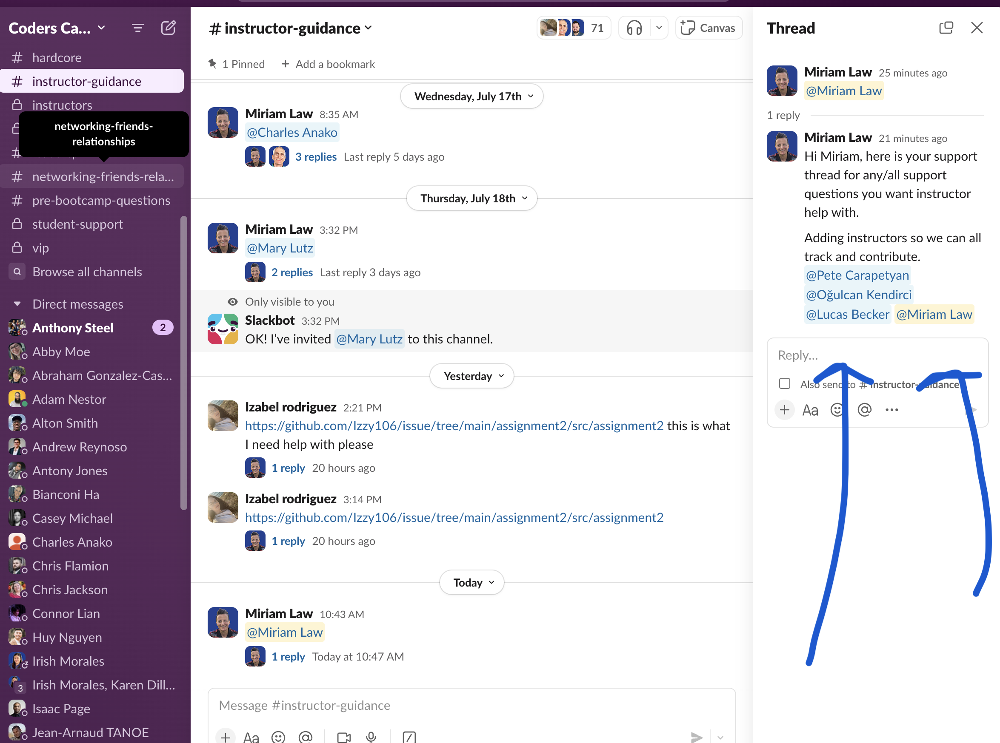

# How To Bookmark Your Support Thread in Slack

1. Instructors will create the Support Thread for you. They will tag the instuctors. 

2. They will send the link to you via a direct message. 
3. Copy the link
4. Navigate to your personal channel on Slack.

5. Click "Create Bookmark" at the top of your personal channel. 

6. Paste the link and rename to "Support Thread". 

7. You will always be able to find your support thread AND click on this link to take you to that thread.

8. It will open to the thread BUT it is important to click inside the chat window where the replies are showing, on the righthand side of the window, when communicating any new support needs or replies.

