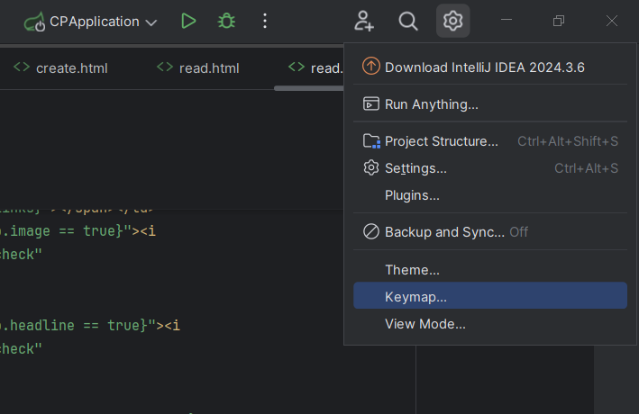
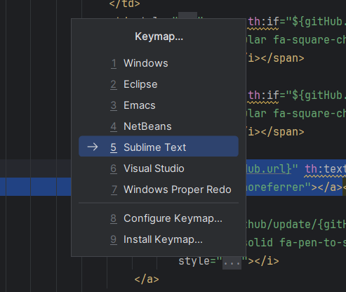
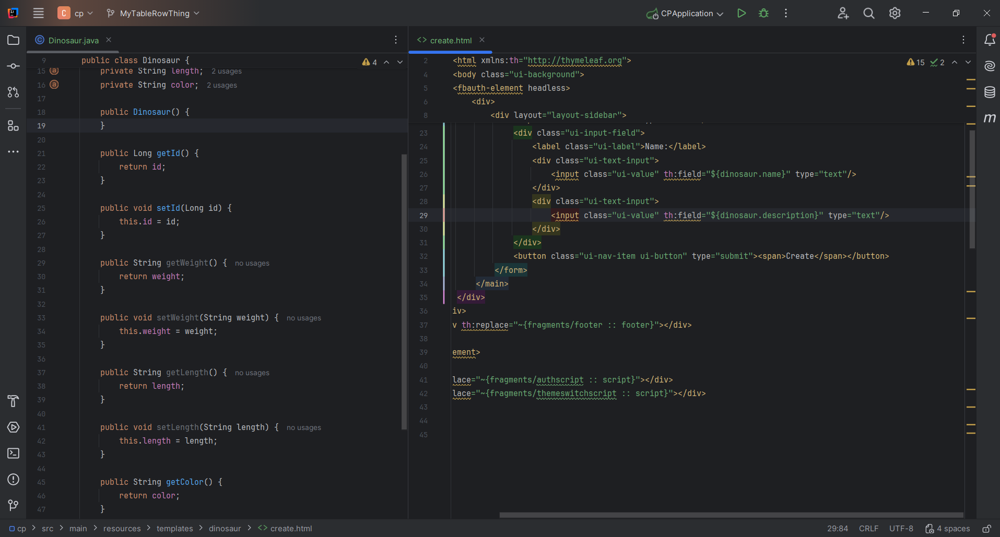
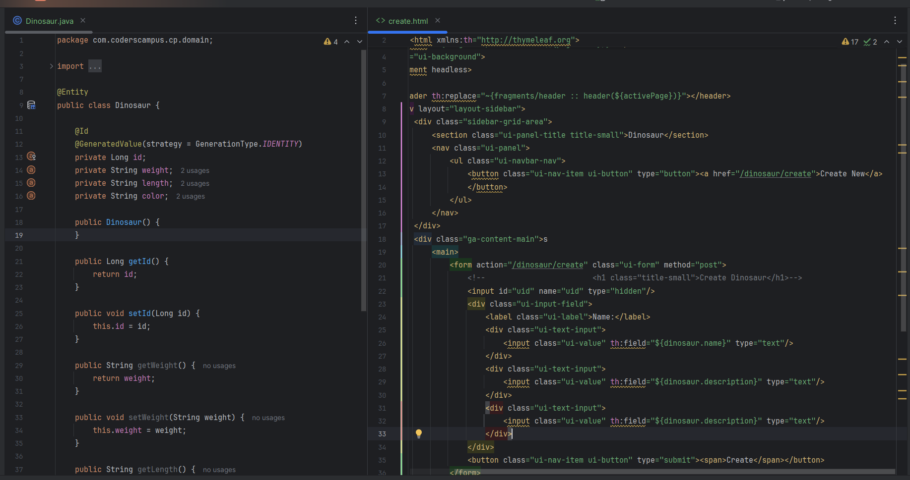
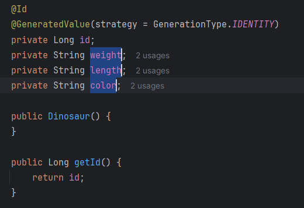
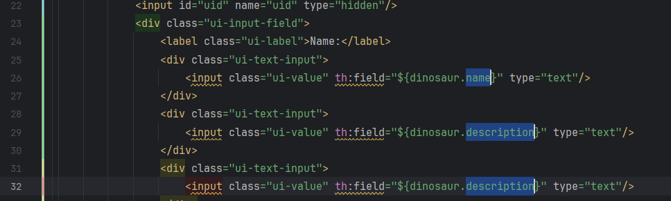
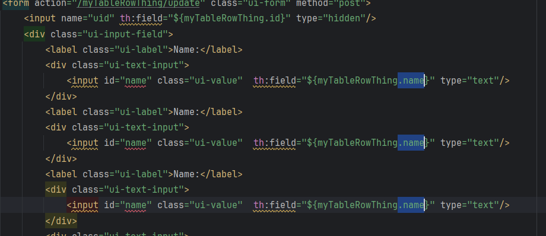

# Why should I use Sublime Text?

Sublime Text is a text and code editor that you can use in IntelliJ to get things done a lot faster when you are editing a template.

With Sublime Text, you can:
-Edit text in multiple places at once
-Automatically select the same text throughout a file
-Copy and paste lines that are spread out from one another

## Enabling Sublime Text in IntelliJ

You first need to select the options/settings dropdown at the top right side of the screen. From this dropdown you will select the keymap option.

Once you do this a screen should appear in the middle of the screen, from which you will select Sublime Text.

Once selected, Sublime Text will be eneabled.

## How to use Sublime Text

In the full stack CRUD test, we copy and paste a template and then edit the fields of it. Sublime Text has a couple tools that make this much, much faster. They are as follows:

1. Control + click allows for multiple insertion points
2. Control + D selects consecutive text of the same value
3. Control + double click allows for selecting multiple chunks of text

### Copying many fields to template

It really comes in handy when you are handling a large amount of fields that are being moved to a template. In this scenario we only have three, but when you have 10+ it can take a long time to copy them all over. Using Sublime Text we can make the process much more efficient.

First I set up my IDE to have the domain object open next to the template I will be editing, I'll start with create. In this image I have already done the find and replace for myTableRowThing to dinosaur.

Now that you have this setup you want to make sure the number of fields displayed on the template to match the number of fileds in your domain object. In this case, our domain object has 3 fields (weight, length, color) and the template has 2 being displayed (shown in lines 25-30 on the "create" template)

To make them match we will copy and paste lines 28-30 to add one more field. You can see it added on lines 31-33.

Now we can get to using Sublime Text to replace the fields on the template with the fields on our domain. The first step is copying the variable names for all of our fields in the domain class.

**PRO TIP: If you get a little pop-up after selecting some text, just hit your escape key to get it to go away.**

To select multiple variable names at once, you will double click on the first one, then hold control and double click the other variable names and do a ctrl + c to copy it. I will look like this:

It can be a little finicky, but with time and practice it gets easy.

After you have it copied, you will select specific parts of the fields on the template to paste it all into at once. Let's start with the part in the input tags after the "th:field=" part. You will use the control double click again to select the text in those areas. It will look like this:

Then just hit ctrl + v to paste and it will have it all in there for you. Sometimes you will need to do it on multiple parts of a template (i.e. if each input has a label that needs to be changed as well), so use it appropriately.

### EXTRA: Using control + d to select the same text in multiple areas

Using control + d with Sublime Text is basically a find and replace function where you can limit the number of ocurrences that you want to edit as long as they are sequential.

**Use Case:** If the template only has an entry for one field and you copy and paste that entry, the text in each entry will be the same (like we did on the "description" entry on the previous example.)

If the use of the field uses that variable name multiple times, you will want to highlight a character specific to that use when you are selecting the field name. Looking somehwat like this:

By selecting the dot before "name" I made it so that hitting control + d won't select the name in id="name". After doing this you can hit **delete, type a new period, then hit ctrl + v** to pase all the variables. I can do the same thing by selecting a quatation mark with name in the id part because it doesn't have that quotation mark with it anywhere else.

This process is slightly more involved, but can really save you some serious time.
