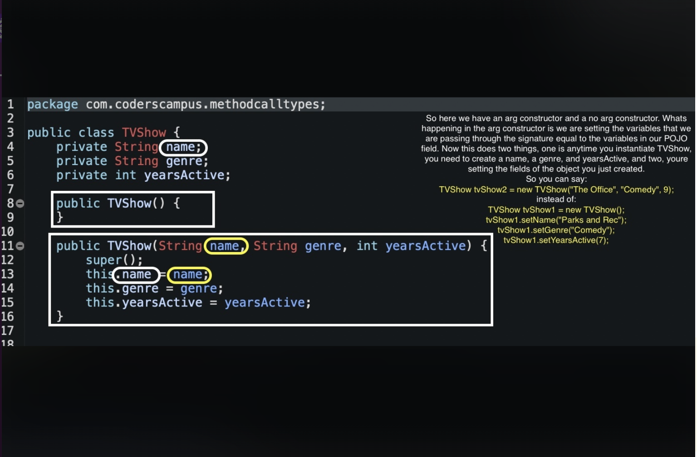

# Snippets from Alex Mamolo

### Understanding Constructors in Java: Leveraging Argument and No-Argument Constructors for Object Initialization

### Understanding the static keyword and constants in Java

**Extra learning from Trevor:**
I don't use static much in the real world.
The only use-case where I ALWAYS use it is with *constants*.

So, if I want to declare a constant, I'll typically make it *public static*, which allows me to reference that constant from anywhere in my app.

An example of a constant is a number or a value that never ever changes, such as Math.PI

PI is 3.14159265.... it never changes.

And when you make it public static that means that you can just use Math.PI to reference that number.

If it was NOT static then you'd have to do:

Math math = new Math()

math.PI

(i.e. you'd have to instantiate the object before you could actually use the constant value)